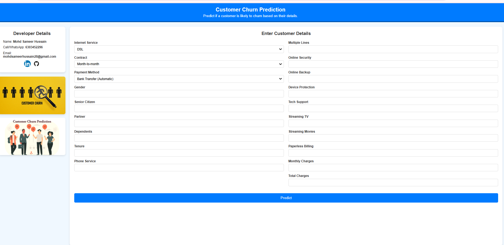
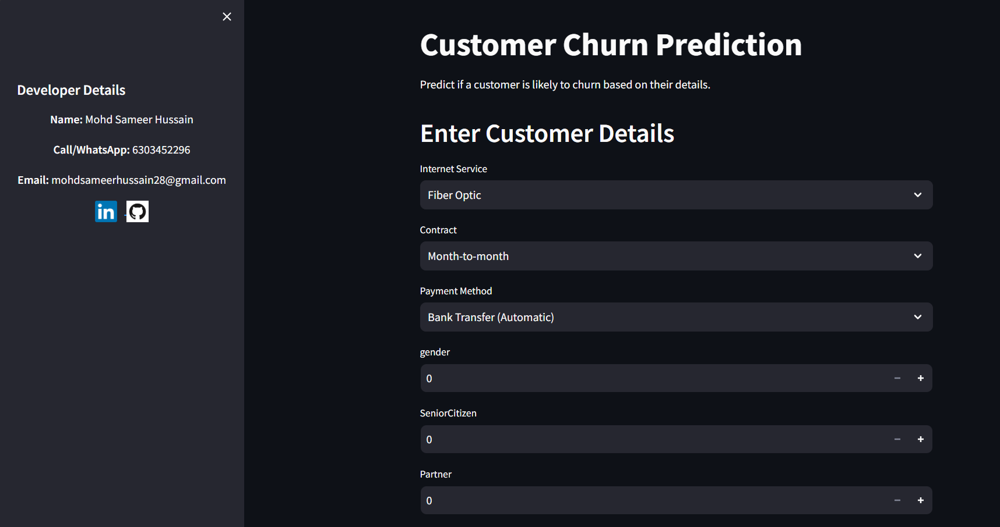
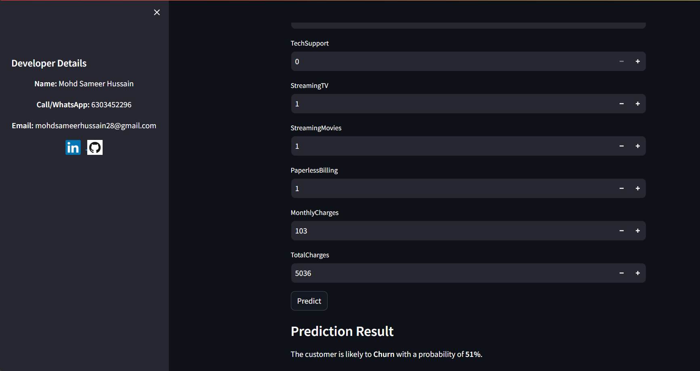

# Customer-churn-prediction-ANN_WebApp
Developed a machine learning and deep learning model that predicts customer churn based on various features, such as demographic details, service usage, and payment methods. The model helps businesses take preemptive actions to reduce churn and improve customer retention.

---
📌 **Goal**

The goal of this project is to use an Artificial Neural Network (ANN) to classify customers as "Churn" or "No Churn" based on their demographic, service usage, and payment details. The model is designed to assist businesses in reducing churn rates and increasing customer satisfaction.

---

🎯 **Objectives**
1. Develop a machine learning model to predict customer churn using an Artificial Neural Network (ANN).
2. Build an interactive web application for easy user interaction and predictions.
3. Provide insights to help businesses retain customers by identifying potential churn risks.
4. Demonstrate deployment of the model on a web platform using Flask and HTML/CSS.

---

## Screenshots

### Input Form
This is the input form where users can provide customer details:

---

### Prediction Result
Model prediction

---

### Streamlit Result

📝 **Description**
### 1. **Data Processing**
The dataset includes customer demographic and account details.
Preprocessing steps include:
- Encoding categorical variables.
- Feature scaling for numerical columns.
- Splitting data into training and testing sets.

### 2. **Model Building**
Built using an Artificial Neural Network (ANN) with the following architecture:
- **Input layer**: Processes the scaled features.
- **Hidden layers**: Three layers with ReLU activation functions.
- **Output layer**: A single neuron with sigmoid activation for binary classification.

### 3. **Web Application**
Frontend: Built with HTML, CSS, Javascript and Flask.

### Deployment:
* Flask: The model was initially deployed using Flask, enabling a user-friendly web interface.
* Streamlit: The final deployment was done using Streamlit for enhanced interactivity and simplicity.
  
Features Used:
Categorical features: Internet service, contract type, payment method.
Numerical features: Monthly charges, total charges, tenure, etc.
Prediction: The model predicts the likelihood of churn and displays the result as "Churn" or "No Churn" with a probability percentage.

---

🔍 **Results**
- The model achieves high accuracy on the test set, effectively predicting customer churn.
- Model predicting the result with accurately whether customer churn or not churn on provided features by user.
- Web application provides an intuitive interface for users to test predictions with real-time feedback.

💡 **Why This Project?**

Customer retention is crucial for business growth and profitability. Churn prediction helps businesses:

- Identify at-risk customers early.
- Formulate personalized strategies to retain these customers.
- Save costs associated with acquiring new customers.

This project aims to bridge the gap between predictive analytics and actionable insights by combining machine learning, deep learning and web deployment.

## 🛠️ Technologies Used
* Backend: Flask, Python Programming
* Frontend: HTML, CSS and Javascript
* Machine Learning Model: Linear Regression (Trained using scikit-learn)
* Deep Learning Model Optimizers - Adam, Relu,Relu, Sigmoid layers
* Database: SQLite for future enhancements
* IDE: Visual Studio Code and Jupyter notebook, Google colabs

### Developer
For more details or any questions, feel free to contact the developer.

**Developed by Mohd Sameer Hussain**  
Email: [mohdsameerhussain28@gmail.com](mailto:mohdsameerhussain28@gmail.com)  
Call/whatsapp: [☎️ +91-6303452296](tel:+916303452296)
